# aws.iam.rbac.security.lab
# AWS IAM security project demonstrating RBAC, least privilege access, MFA implementation and user permission validation
## Project Overview

This project demonstrates the implementation of Identity and Access Management secuirty controls within AWS. The project focused on applying cloud secuirty principles such as least privilege access, permission management and user access validation. 

## Objectives 
- Create and manage AWS IAM users and groups
- Implemented role based access control using IAM groups
- Apply AWS managed and custom IAM policies
- Configure multi-factor authentication
- Test user permissions to validate access controls
- Identify and troubleshoot permission issues

 ## AWS Services Used 
   - Amazon Web Services
   - Identity and Access Management
   - IAM Policies
   - IAM Groups
   - Multi-Factor Authentication  

## IAM Environment 
The AWS IAM environment was designed to simulate role based access control within a small organization. Individual users were assigned to department specific IAM groups, with permissions based on their job responsibilities. 

| User| Department | IAM Group | Access Level | 
|-----|------------|-----------|--------------|
| John | IT        | IT-Admin   | Administrator Access |
| Alex | Marketing | Marketing | Custome Amazon S3 Read only Policy |
| Emily | Sales    | Sales     | AWS Managed ReadOnlyAccess | 
| Mike | Finance   | Finance   | Billing Access | 

This design demonstartes the principle of least privilege by assigning users only the permissions required for their role whenever possible. 

## Project Screenshots 
## 1. IAM User and Group Structure

   #### IAM Users
   
   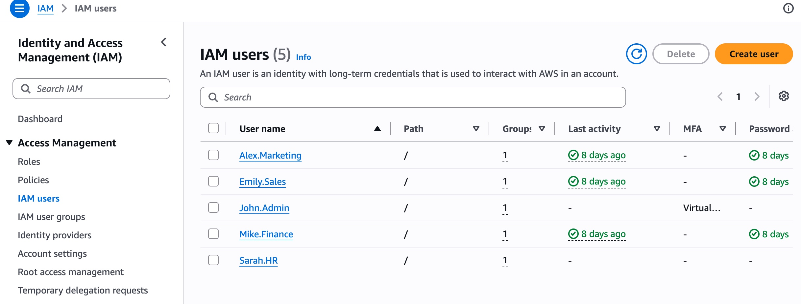
   

   #### IAM Groups
   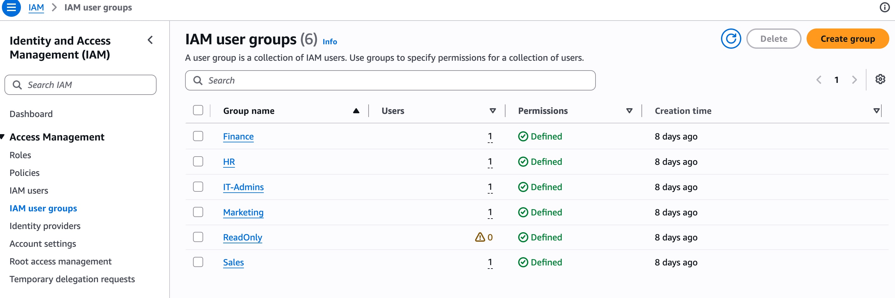

 ## 2. Role-Based Access Control (RBAC) Implementation
    
   ### IT Admin Group
   
   #### IT Admin Users
   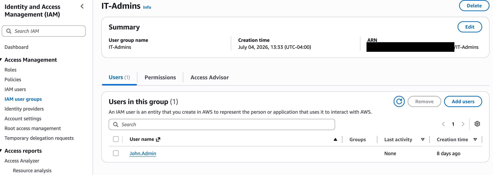 
   
   #### IT Admin Permissions
   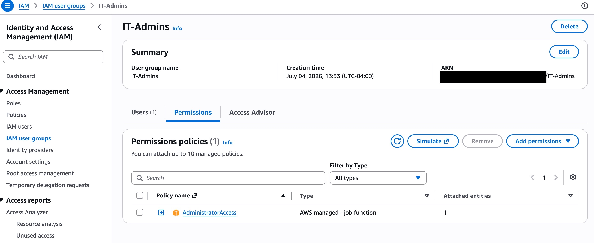 
    
   ### Marketing Group 
   
   #### Marketing Users 
   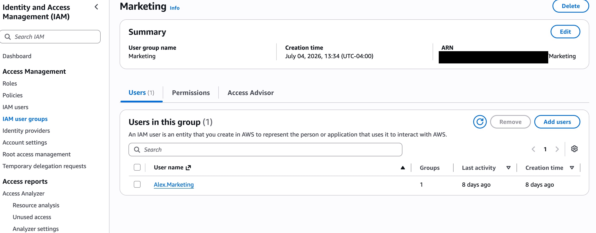 

   #### Marketing Permissions
   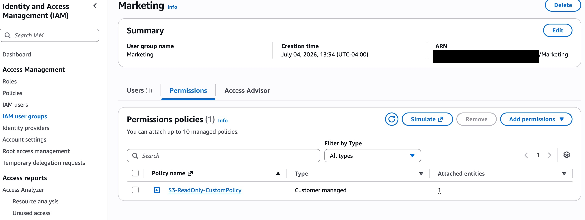 

   ### Sales Group 

   #### Sales Users
   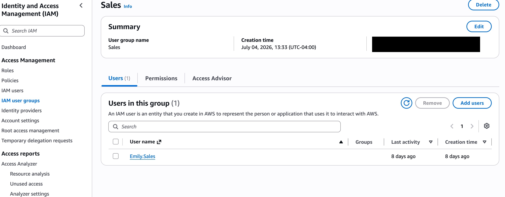 
   #### Sales Permissions
   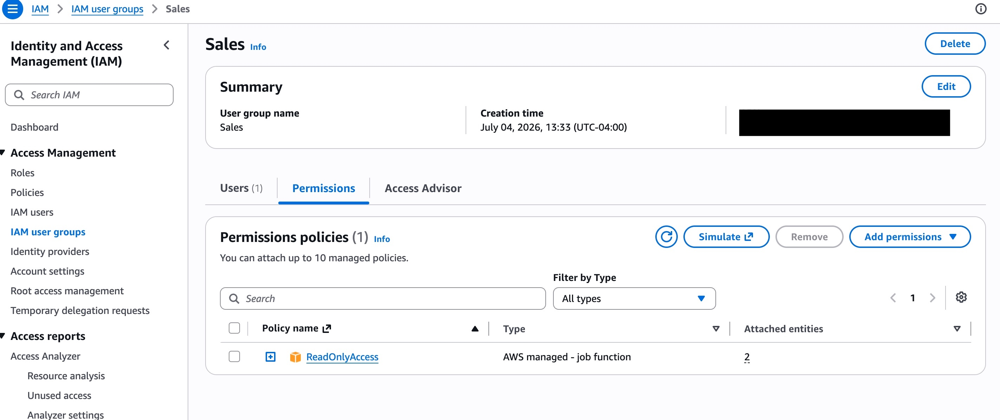 

   ### Finance Group 
   
   #### Finance Users 
   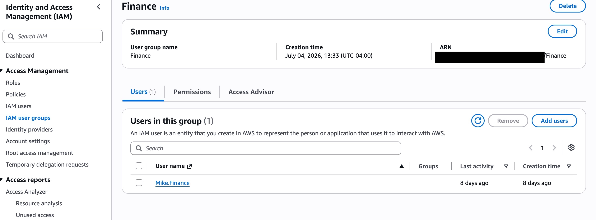 
   #### Finance Permission
   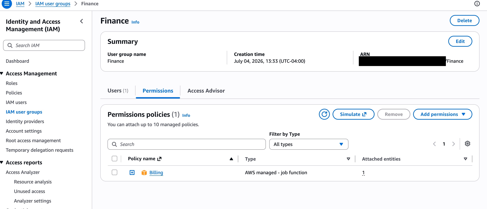 

## 3. Security Controls 

 #### Custom S3 Read-Only Policy 
   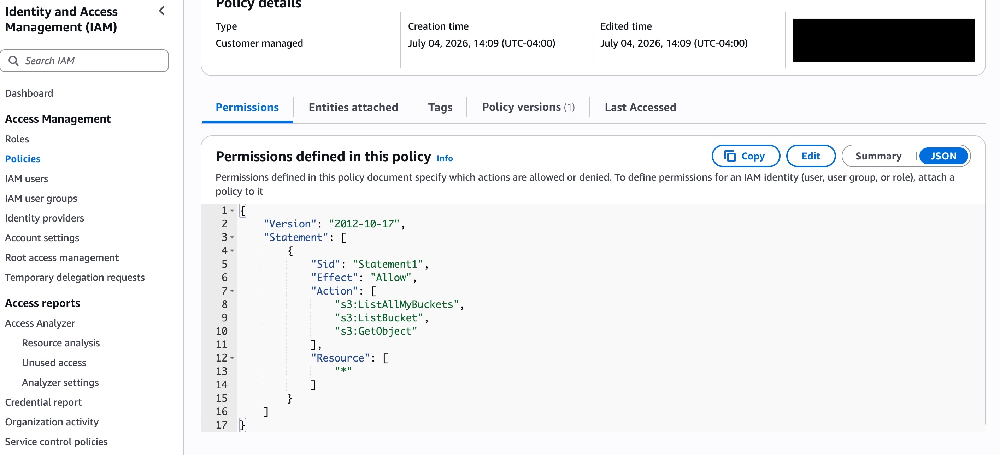
   
 #### MFA Enabled
   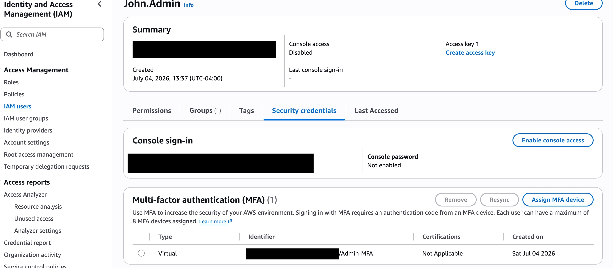

## 4. S3 Resource Creation and Permission Testing

 #### S3 Bucket Created 
 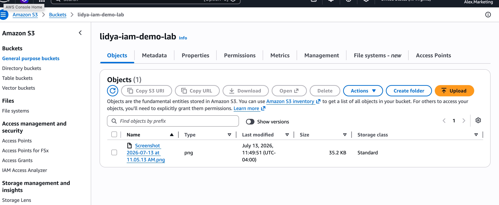
 
 #### Admin S3 Upload  Success 
 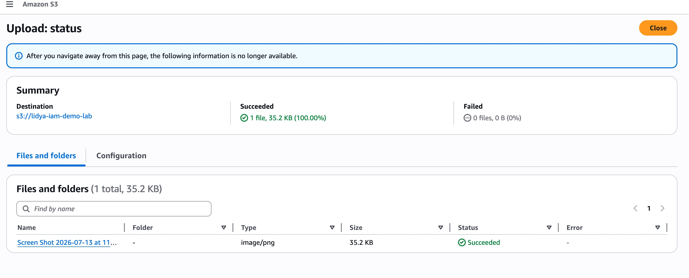
 
 #### Alex S3 Read Access 
 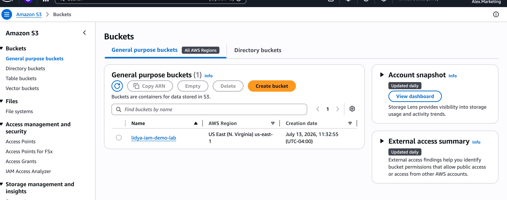 
 
 #### Alex Upload Access Denied
 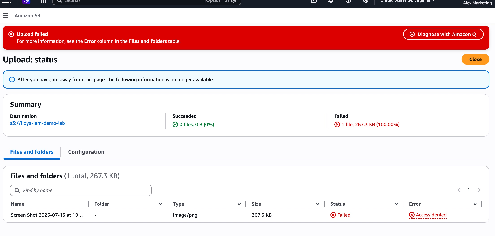
 
 #### Mike Finance Access Denied
 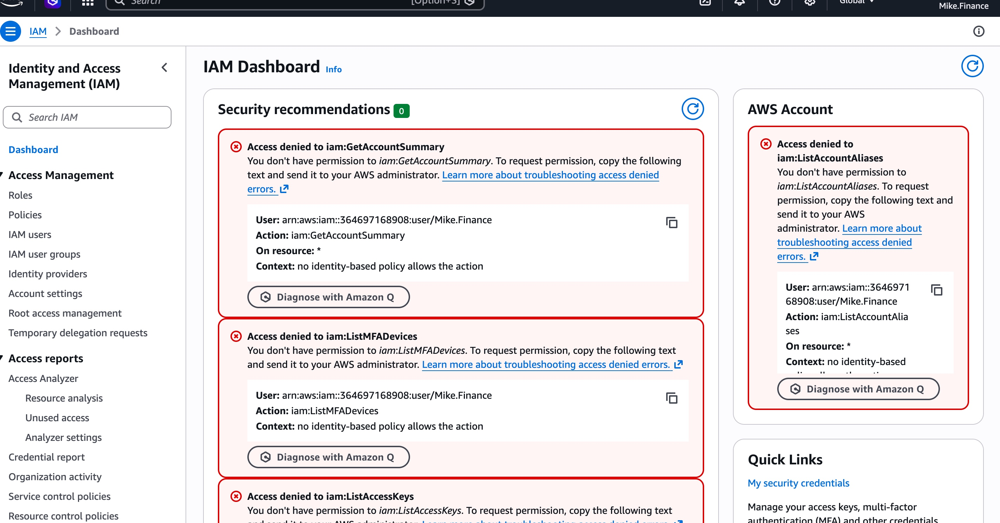

## Testing & Validation 
(Next) 

## Lessons Learned
(Next) 
